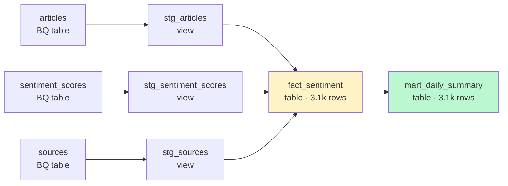

# PTT Stock Sentiment Analysis


> 📘 **所有操作指令統一入口：** [`COMMANDS.md`](COMMANDS.md) ｜ `python dependent_code/cli.py --help`

## 🔗 Demo

| 服務             | 網址                            | 狀態 |
| ---------------- | ------------------------------- | ---- |
| REST API (Swagger) | http://52.65.94.221:8000/docs | ✅ live（JWT bcrypt + Prometheus metrics live）|
| Streamlit 儀表板 | http://52.65.94.221:8501      | ✅ live |
| Prometheus metrics | http://52.65.94.221:8000/metrics | ✅ live（`api_request_duration_seconds` / `articles_scraped_total` / `etl_step_duration_seconds`） |
| Swagger quick test | `admin` / `admin123`（bcrypt hash；production 需設 `ADMIN_PW_HASH` env var 覆寫） | |

> **Note**：資料截至 2026-04-22（articles 累計 172,619 筆，pipeline 持續補爬中）。`/sentiments/today` 若當日無資料會回 404（`{"message":"No data for today"}`）而非 500，查看已存在日期請用 `/sentiments/recent?period=30`。

## 專案簡介

多來源財經新聞情緒分析系統。爬取 PTT、鉅亨網、Reddit、CNN、WSJ、MarketWatch 等來源，建立資料庫進行 BERT 情緒分析，並提供 REST API 與視覺化儀表板。

## 技術棧

- **爬蟲**：Python, requests, BeautifulSoup（CNN/WSJ/MarketWatch 改用 sitemap XML 解析）
- **資料處理**：Pandas, tqdm
- **NLP**：KeyBERT（關鍵字抽取），BERT（情緒分析）
- **資料庫**：PostgreSQL（Docker，含 Stored Procedure / Materialized View），MongoDB（Docker，raw 儲存）
- **API**：FastAPI, uvicorn, Pydantic（response model + 爬蟲入庫驗證）
- **快取**：Redis（Cache-Aside Pattern）
- **視覺化**：Streamlit, Matplotlib
- **測試**：pytest, Great Expectations
- **容器化**：Docker, Docker Compose（9 services：PostgreSQL / Redis / API / Worker / Airflow ×3 / Prometheus / Grafana）
- **排程**：Apache Airflow（8-task DAG，fail-soft trigger_rule）, Celery（非同步任務佇列）
- **監控**：Prometheus（metrics 收集）, Grafana（視覺化儀表板）
- **容器編排**：Kubernetes（Deployment / Service / CronJob / ConfigMap / Secret）
- **CI/CD**：GitHub Actions
- **雲端**：AWS EC2, AWS S3

## 架構圖

```
PTT Stock 板 / 鉅亨網 / Reddit（增量） / Reddit 歷史（Arctic Shift） / CNN / WSJ / MarketWatch
        ↓
  scrapers/（ptt_scraper、cnyes_scraper、reddit_scraper、reddit_batch_loader、cnn_scraper、wsj_scraper、marketwatch_scraper）
        ↓
  base_scraper（統一寫入 DB）
        ↓
PostgreSQL（OLTP）                    MongoDB（schema-less）
├── sources                            └── raw_responses（原始 HTTP 回應）
├── articles
├── comments
├── article_labels    ← 人工標注
├── sentiment_scores  ← BERT 推論
├── stock_prices      ← 0050（TWSE API）
└── us_stock_prices   ← VOO（yfinance）
        ↓                                   ↓
  QA_checks() 失敗？
    → reparse.py 自動修復
    → MongoDB raw → re-parse → UPDATE PG
        ↓
  dw_etl.py（Star Schema ETL）
  DW（Snowflake Schema）
  ├── dim_market / dim_source（tracked_stock） / dim_stock
  ├── fact_sentiment（stock_symbol denormalized）
  ├── Data Mart（source 粒度，Stored Procedure 刷新：TRUNCATE+INSERT）
  │   └── mart_daily_summary（API + 儀表板用，sp_refresh_mart_daily_summary）
  └── Materialized View（market 粒度，REFRESH MATERIALIZED VIEW）
      └── mv_market_summary（Snowflake 三表 JOIN：fact → dim_source → dim_market）
        ↓
  api.py + Redis（Cache-Aside）
        ↓
  visualization.py（Streamlit）

排程與部署：
  ├── launchd（macOS 本機，每小時 :25 分）→ run_etl.sh → pipeline.py
  ├── Airflow DAG（Docker，8-task 線性 pipeline）→ etl_dag.py
  ├── K8s CronJob（雲端，每小時 :25 分）→ cronjob.yaml → pipeline.py
  └── Celery（非同步，Redis broker）→ tasks.py

監控：
  Prometheus（scrape /metrics）→ Grafana（dashboard）
```

### dbt on BigQuery — Cloud DW Lineage

PostgreSQL DW 之外另外實作 **dbt + BigQuery** 版本（`dbt/` folder），同一份 SQL 邏輯可跑 PG（`--target dev`）或 BQ（`--target bigquery`），展示 Cloud DW migration 能力。



**實跑結果**（`ptt_sentiment` dataset，2026-04-19）：

| Model | Type | Rows | 用途 |
|---|---|---:|---|
| `stg_articles` / `stg_sentiment_scores` / `stg_sources` | view | – | 型別轉換 + 跨 adapter（PG/BQ）cast 宏 |
| `fact_sentiment` | table | 3,124 | 粒度 (fact_date × source_id)，含 pos/neu/neg count |
| `mart_daily_summary` | table | 3,124 | API / 儀表板直讀，source 粒度 |

**跨 adapter 對照**（同一 dbt model 在兩個 target 上的差異）：

| 概念 | PostgreSQL | BigQuery |
|---|---|---|
| 型別投射 | `col::TYPE` | `CAST(col AS TYPE)` ← 用 `{{ dbt.type_*() }}` 宏跨 adapter |
| 條件計數 | `COUNT(x) FILTER (WHERE ...)` | `COUNT(CASE WHEN ... THEN 1 END)` |
| 字串型別 | `TEXT` / `VARCHAR(n)` | `STRING` |
| 浮點型別 | `NUMERIC(m,n)` / `REAL` | `FLOAT64` |

**指令**：

```bash
cd dbt

# 本機 PG 跑
GCP_PROJECT=... BQ_DATASET=ptt_sentiment BQ_LOCATION=US \
  dbt run --target dev --profiles-dir .

# BigQuery 跑
GCP_KEYFILE=/path/to/key.json \
  dbt run --target bigquery --profiles-dir .

# 產出 docs 站（含 lineage graph）
dbt docs generate --profiles-dir .
dbt docs serve --profiles-dir .   # 本機 port 8080 開啟互動式 docs
```

**資料品質驗證**：9 個 dbt tests（not_null × 7 + `dbt_utils.unique_combination_of_columns` × 2），確保 fact/mart 欄位完整性。

## 專案結構

```
project/
├── dependent_code/
│   ├── pipeline.py           # 主流程（8-step：schema → extract → transform → pii → bert → dw_etl → backup → ai_predict）
│   ├── cli.py                # 統一 CLI 入口（本機測試 & 手動觸發各功能）
│   ├── config.py             # 集中管理所有常數 + SOURCES 唯一 source of truth（新增來源只需加一筆 entry）
│   ├── schema.py             # PostgreSQL 建表 + index
│   ├── pg_helper.py          # PostgreSQL 連線管理（context manager）
│   ├── cache_helper.py       # Redis Cache-Aside helper
│   ├── scrapers/
│   │   ├── __init__.py           # sys.path 統一設定
│   │   ├── base_scraper.py       # 爬蟲抽象父類別（DB 寫入邏輯）
│   │   ├── ptt_scraper.py        # PTT Stock 板爬蟲
│   │   ├── cnyes_scraper.py      # 鉅亨網爬蟲
│   │   ├── reddit_scraper.py     # Reddit 財經版增量爬蟲
│   │   ├── reddit_batch_loader.py# Reddit 歷史大量資料載入器（Arctic Shift API）
│   │   ├── cnn_scraper.py        # CNN 財經新聞爬蟲（Search API + full-text）
│   │   ├── wsj_scraper.py        # WSJ 財經新聞爬蟲（RSS feeds + Google News RSS）
│   │   ├── marketwatch_scraper.py# MarketWatch 財經新聞爬蟲（RSS feeds + Google News RSS）
│   │   ├── scraper_schemas.py    # Pydantic 資料驗證 schema
│   │   ├── tw_stock_fetcher.py   # 0050 股價抓取（TWSE API）
│   │   └── us_stock_fetcher.py   # VOO 股價抓取（yfinance）
│   ├── api.py                # FastAPI REST API
│   ├── visualization.py      # Streamlit 儀表板
│   ├── plt_function.py       # matplotlib 圖表函式
│   ├── QA.py                 # 資料品質檢查（pipeline 自動呼叫）
│   ├── ge_validation.py      # Great Expectations 資料驗證
│   ├── test_api.py           # pytest 自動測試
│   ├── backup.py             # S3 備份（pg_dump）
│   ├── dw_schema.py          # DW Star/Snowflake Schema DDL（dim_market / dim_source / dim_stock / fact_sentiment）+ Data Mart + Materialized View
│   ├── dw_etl.py             # OLTP → DW incremental ETL
│   ├── data_mart.py          # Data Mart 刷新 + 查詢介面
│   ├── bert_sentiment.py     # BERT fine-tune / evaluate / batch inference
│   ├── labeling_tool.py      # Streamlit 人工標注工具
│   ├── reparse.py            # 資料修復管線（MongoDB raw → re-parse → UPDATE PG）
│   ├── pii_masking.py        # PII 遮蔽（author hash 化）
│   ├── auth.py               # JWT 認證（verify_token）
│   ├── mongo_helper.py       # MongoDB raw_responses helper
│   ├── ai_model_prediction.py # AI 模型預測系統（Walk-Forward + RandomForest）
│   ├── llm_labeling.py       # LLM 輔助情緒標注（Google Gemini 2.5 Flash，寫入 article_labels）
│   ├── perf_tuning.py        # PostgreSQL 效能審計（慢查詢 / 未使用 index / 連線池）
│   ├── metrics.py            # Prometheus 監控指標（Counter / Gauge / Histogram）
│   ├── celery_app.py         # Celery 非同步任務佇列（Redis broker/backend）
│   ├── tasks.py              # Celery task 定義（pipeline 各步驟 + full chain）
│   ├── scrapers/
│   │   └── wayback_backfill.py # Wayback Machine CDX API 回填爬蟲（CNN/WSJ 歷史文章）
│   └── requirements.txt      # 套件清單
├── Dockerfile                # Docker image（python:3.9-slim + dependent_code + init_marts.sql）
├── docker-compose.yml        # 9 services（postgres / redis / api / worker / airflow × 3 / prometheus / grafana）
├── airflow/
│   └── dags/
│       └── etl_dag.py        # Airflow DAG（8-task 線性 pipeline，fail-soft trigger_rule）
├── k8s/
│   ├── api-deployment.yaml   # FastAPI Deployment（2 replicas）+ LoadBalancer Service
│   ├── cronjob.yaml          # K8s CronJob（每小時 :25 分執行 pipeline.py，每次啟新 Pod、跑完即刪）
│   ├── postgres-deployment.yaml  # PostgreSQL StatefulSet + PVC + ClusterIP Service
│   ├── redis-deployment.yaml     # Redis Deployment + ClusterIP Service
│   ├── namespace.yaml        # namespace: stock-sentiment
│   ├── configmap.yaml        # 非敏感環境變數
│   └── secret.yaml           # 模板；真密碼由 scripts/apply_k8s_secrets.sh 從 .env 注入
├── grafana/
│   └── provisioning/
│       ├── datasources/prometheus.yml  # Grafana 自動註冊 Prometheus datasource
│       └── dashboards/dashboard.yml    # Grafana 自動載入 dashboard JSON
├── prometheus.yml            # Prometheus scrape config（self + fastapi:8001）
├── scripts/
│   ├── run_etl.sh            # 自動化 ETL（launchd 每小時執行）
│   ├── init_marts.sql        # Stored Procedure / Function 定義（SP 刷新 + 情緒查詢 Function）
│   ├── deploy.sh             # EC2 部署腳本
│   └── health_check.sh       # 服務健康檢查腳本
├── logs/                     # ETL 執行 log（不進 git）
└── .github/workflows/
    └── deploy.yml            # CI/CD（pytest → EC2 部署）
```

## 資料庫 Schema

### PostgreSQL（正規化，目前使用）

**sources**（資料來源）

| 欄位        | 型別         | 說明                          |
| ----------- | ------------ | ----------------------------- |
| source_id   | SERIAL PK    | 自動遞增                      |
| source_name | VARCHAR(100) | e.g. "ptt"                    |
| url         | TEXT UNIQUE  | e.g. "https://ptt.cc/bbs/Stock" |

**articles**（文章，不含情緒分數）

| 欄位         | 型別           | 說明                        |
| ------------ | -------------- | --------------------------- |
| article_id   | SERIAL PK      | 自動遞增                    |
| source_id    | INTEGER FK NN  | 對應 sources                |
| title        | TEXT NN        | 文章標題                    |
| push_count   | INTEGER        | 推噓數（鉅亨網為 NULL）     |
| author       | VARCHAR        | 作者（可為 NULL）           |
| url          | TEXT NN UNIQUE | 文章網址                    |
| content      | TEXT NN        | 內文                        |
| published_at | TIMESTAMP NN   | 發文時間                    |
| scraped_at   | TIMESTAMP      | 爬取時間（DEFAULT NOW()）   |

**comments**（留言）

| 欄位       | 型別          | 說明     |
| ---------- | ------------- | -------- |
| comment_id | INTEGER PK    | 自動遞增 |
| article_id | INTEGER FK NN | 對應文章 |
| user_id    | VARCHAR NN    | 推文者   |
| push_tag   | VARCHAR NN    | 推/噓/→  |
| message    | TEXT NN       | 推文內容 |

**sentiment_scores**（情緒分數，每篇文章一筆，BERT 實作後填入）

| 欄位         | 型別       | 說明                |
| ------------ | ---------- | ------------------- |
| score_id     | SERIAL PK  | 自動遞增            |
| article_id   | INTEGER FK | 對應 articles       |
| score        | REAL       | 情緒分數            |
| calculated_at | TIMESTAMP | 計算時間            |

**stock_prices**（0050 股價，TWSE API 每月抓取）

| 欄位       | 型別          | 說明                     |
| ---------- | ------------- | ------------------------ |
| price_id   | SERIAL PK     | 自動遞增                 |
| trade_date | DATE UNIQUE   | 交易日（唯一，只追蹤 0050）|
| close      | NUMERIC(10,2) | 收盤價                   |
| change     | NUMERIC(10,2) | 漲跌價差                 |

**us_stock_prices**（VOO 股價，yfinance 抓取）

| 欄位       | 型別          | 說明                         |
| ---------- | ------------- | ---------------------------- |
| price_id   | SERIAL PK     | 自動遞增                     |
| trade_date | DATE UNIQUE   | 交易日（唯一，只追蹤 VOO）   |
| close      | NUMERIC(10,2) | 收盤價                       |
| change     | NUMERIC(10,2) | 漲跌價差                     |

## Commit Tag 對照表

每個 annotated tag 名稱直接取自 `daily_guide_v2.html` 任務名，標記對應的任務完成 commit。

| Phase | Tag | 說明 |
|-------|-----|------|
| Phase 1 | `Phase1·Python爬蟲` | PTT 爬蟲實作（requests + BeautifulSoup）|
| Phase 1 | `Phase1·HTML解析` | HTML 解析與欄位抽取 |
| Phase 1 | `Phase1·Schema設計` | SQLite/PostgreSQL 資料表設計 |
| Phase 1 | `Phase1·logging` | logging 取代 print，結構化日誌 |
| Phase 1 | `Phase1·錯誤處理retry` | requests retry + exponential backoff |
| Phase 1 | `Phase1·IncrementalLoading` | URL 去重，只爬新資料 |
| Phase 1 | `Phase1·資料品質檢查` | QA.py 自動化資料品質檢查 |
| Phase 1 | `Phase1·Index設計` | B-tree index 設計與 EXPLAIN ANALYZE |
| Phase 1 | `Phase1·備份與恢復` | backup.py + pg_dump + S3 |
| Phase 2 | `Phase2·Pandas資料清洗` | Pandas 型別轉換、空值處理、去重 |
| Phase 2 | `Phase2·推噓數格式轉換` | PTT 推噓數爆/XX/X格式正規化 |
| Phase 2 | `Phase2·日期處理` | Unix timestamp → datetime 轉換 |
| Phase 2 | `Phase2·Matplotlib視覺化` | matplotlib 情緒趨勢圖 |
| Phase 2 | `Phase2·Streamlit儀表板` | Streamlit 互動式網頁儀表板 |
| Phase 2 | `Phase2·GreatExpectations` | Great Expectations 資料驗證 |
| Phase 3 | `Phase3·FastAPI` | FastAPI app 與 uvicorn 部署 |
| Phase 3 | `Phase3·REST_API設計` | RESTful endpoint 設計 |
| Phase 3 | `Phase3·pytest` | pytest 自動測試 + mock |
| Phase 3 | `Phase3·Shell自動化` | run_etl.sh + launchd 排程 |
| Phase 3 | `Phase3·環境變數管理` | config.py 集中管理常數與環境變數 |
| Phase 4 | `Phase4·PostgreSQL遷移` | SQLite → PostgreSQL 遷移 |
| Phase 4 | `Phase4·Redis快取` | Redis Cache-Aside Pattern |
| Phase 4 | `Phase4·多來源爬蟲` | PTT + 鉅亨網 OOP 爬蟲架構 |
| Phase 4 | `Phase4·Pydantic驗證` | Pydantic response model + 入庫驗證 + Reddit/VOO 爬蟲 |
| Phase 4 | `Phase4·多來源ETL` | ThreadPoolExecutor 並行 pipeline（待確認無誤後打 tag）|

## API Endpoints

| Method | Endpoint           | 說明                                |
| ------ | ------------------ | ----------------------------------- |
| GET    | /sentiments/today  | 今日平均情緒分數                    |
| GET    | /sentiments/change | 今昨情緒變化量                      |
| GET    | /sentiments/recent | 近 N 天情緒分數（回傳 period + sentiment_score） |
| GET    | /articles/top_push | 熱門文章排行（回傳 limit + articles）            |
| GET    | /articles/search   | 關鍵字搜尋文章                      |
| GET    | /health            | 資料庫健康檢查                      |
| GET    | /correlation/0050  | PTT 情緒 vs 0050 隔日漲跌相關性     |
| POST   | /auth/login        | JWT 登入取得 token                   |
| GET    | /ai_model_prediction/{market} | AI 模型預測結果（tw/us）   |

## 安裝與執行

```bash
# 1. clone 專案
git clone https://github.com/andrew841018-design/ptt_stock_db.git
cd ptt_stock_db

# 2. 建立虛擬環境
python3 -m venv venv
source venv/bin/activate

# 3. 安裝套件
pip install -r requirements.txt

# 4. 建立資料庫 Schema
python3 dependent_code/schema.py

# 5. 執行爬蟲 + 清洗 + 分析
python3 dependent_code/pipeline.py

# 6. 啟動視覺化儀表板
streamlit run dependent_code/visualization.py

# 7. 啟動 API
cd dependent_code && uvicorn api:app --reload

# 8. 執行測試
pytest dependent_code/test_api.py -v
```

## 自動化排程

ETL 每小時自動執行（:25 分），支援三種排程方式：

| 方式 | 環境 | 設定 |
|------|------|------|
| **launchd** | macOS 本機 | `~/Library/LaunchAgents/` plist → `run_etl.sh` |
| **Airflow DAG** | Docker Compose | `airflow/dags/etl_dag.py`（8-task 線性 pipeline） |
| **K8s CronJob** | Kubernetes 叢集 | `k8s/cronjob.yaml`（Forbid concurrency） |

> macOS Sequoia 上 cron daemon 無法啟動，改用 launchd。
> plist 位於 `~/Library/LaunchAgents/`，script 放在 `~/scripts/run_etl.sh`（PROJECT_DIR 硬編碼，避免 launchd CWD=/ 路徑問題）

```
schema → extract（PTT + 鉅亨網 + Reddit + CNN + WSJ + MarketWatch + TWSE + VOO）→ transform（QA + 自動修復 + GE）→ PII 遮蔽 → BERT 推論 → DW ETL → S3 備份 → AI 預測
```

執行 log 存於 `logs/etl_YYYYMMDD.log`，每次結束自動產生摘要：

```
[...] ---------- 執行摘要 ----------
[...] ERROR 數量：0
[...] WARNING 數量：0
[...] ===== ETL 完成 =====
```

## 未來規劃

- [x] Phase 4：PostgreSQL 正規化 Schema 設計完成（Docker）
- [x] Phase 4：create_schema.sql 執行完成（4 張表 + 4 個 B-tree index）
- [x] Phase 4：backup.py 改用 config.DB_PATH；ge_validation.py import bug 修復
- [x] launchd 排程修復（cron daemon 在 macOS Sequoia 失效，改用 launchd）
- [x] requirements.txt 補齊（psycopg2-binary、great_expectations）
- [x] 多來源爬蟲（PTT + 鉅亨網），Dcard 因 Cloudflare 封鎖移除
- [x] TWSE API 抓取 0050 股價，寫入 stock_prices 表
- [x] 情緒 vs 股價相關性分析 endpoint（/correlation/0050）
- [x] Redis Cache-Aside 實作（37x 加速）
- [x] jieba 移除，改以 BERT 為目標情緒分析方案
- [x] KeyBERT 關鍵字抽取（取代 regex 斷詞）
- [x] stock_prices 欄位精簡（移除 stock_no/stock_name/volume，只追蹤 0050）
- [x] GROUP BY Subquery 模式（相關性查詢架構正確化）
- [x] BERT config 框架（config.py 已定義所有權重與模型名稱）
- [x] 爬蟲 retry 機制（base_scraper exponential backoff，MAX_RETRY=5）
- [x] QA 強化（sources/來源專屬檢查、schema NOT NULL 約束對齊）
- [x] cnyes API 結構修正（`items.data` 路徑）
- [x] hardcoded 字串清查（backup.py 容器名稱修正、TWSE sleep、S3 bucket 移進 config）
- [x] api.py `pd.to_datetime()` 移至 `load_articles_df()` 只轉換一次
- [x] ge_validation.py 來源分離（PTT / 鉅亨網各自套用規則）
- [x] Pydantic response model（所有 endpoint 加上 response_model=，Swagger 自動文件）
- [x] scraper_schemas.py（爬蟲入庫前 Pydantic 驗證：title、url、push_count、published_at）
- [x] API 動態 key 改為固定 key（/sentiments/recent、/articles/top_push）
- [x] Optional[X] 全改為 X | None（Python 3.10+ 語法）
- [x] Bug fix：api.py get_top_push_articles 共享 DataFrame in-place mutation（加 df.copy()）
- [x] Bug fix：ptt_scraper X 前綴推文數計算錯誤（X1=-1 → 應為 X1=-10，乘以 10）
- [x] Bug fix：ptt_scraper _parse_push_count ValueError 改為 log warning + return None，防止崩潰
- [x] Bug fix：cnyes_scraper publishAt 改 item.get() + early return None 防 KeyError
- [x] Bug fix：visualization.py yesterday 空集合時 NaN delta 改為顯示 0
- [x] 多來源 ETL 整合：pipeline.py 改用 `concurrent.futures.ThreadPoolExecutor` 並行爬取 PTT + 鉅亨網 + TWSE，ETL 三階段明確分層
- [x] Bug fix：`str|None` Python 3.9 不相容（5 個檔案改回 `Optional[X]`），修復 cnyes scraper 靜默失敗問題
- [x] Reddit 多版面爬蟲（r/investing + r/stocks + r/wallstreetbets + Bogleheads + personalfinance + financialindependence）
- [x] Arctic Shift 歷史資料載入器（Reddit 2005 年至今完整存檔）
- [x] us_stock_prices 表建立（VOO，yfinance 抓取）
- [x] scraper_schemas.py Pydantic 驗證（ArticleSchema / CommentSchema）
- [x] `_get_with_retry` OOP 架構完善（BaseScraper 實例方法 + module-level 函式並存）
- [x] schema.py SQL comment 標注追蹤標的（0050 / VOO）
- [x] pipeline.py 升級為 ThreadPoolExecutor 並行版本（ETL 三階段分層：extract / transform / load）
- [x] Bug fix：_get_or_create_source 加 ON CONFLICT DO NOTHING，解決並行 race condition
- [x] Bug fix：get_with_retry 改 raise 保留完整 traceback
- [x] Bug fix：cnyes_scraper title 加 .strip() 統一格式
- [x] Bug fix：requirements.txt 移除重複 pydantic
- [x] Phase 4：Star Schema + Snowflake Schema（dim_market 延伸）
- [x] Phase 4：Data Mart（mart_daily_summary，source 粒度）
- [x] Phase 4：Materialized View（mv_market_summary，Snowflake 三表 JOIN，market 粒度）
- [x] ~~Phase 4：Data Lake~~ → 移除（MongoDB raw_responses 已涵蓋 raw layer，專案規模不需要 S3 三層）
- [x] Phase 4：MongoDB（raw_responses 原始 HTTP 存檔）
- [x] Phase 4：自動修復管線（reparse.py：QA 失敗 → MongoDB re-parse → UPDATE PG）
- [x] Phase 4：article_labels 表名集中管理（config.py ARTICLE_LABELS_TABLE）
- [x] Phase 4：launchd 排程改為每小時執行（:25 分）
- [x] Phase 4：base_scraper `_store_raw()` 原始 HTTP 回應自動存入 MongoDB raw_responses
- [x] Database 改名 ptt_stock → stock_analysis_db
- [x] config.py 局部性原則重構（15+ 常數搬回各自模組）
- [x] source_name 統一（PTT Stock/鉅亨網/Reddit Finance → ptt/cnyes/reddit）
- [x] schema.py 角色權限完整註解（GRANT/REVOKE/SEQUENCE/pg_roles）
- [x] backup.py 移除 PG_CONFIG 間接存取，改用 os.environ.get() 直讀
- [x] schema.py 角色建立改用 os.environ.get() 直讀（移除 PG_API_CONFIG 間接層）
- [x] MongoDB 清理：移除 raw_articles collection，只保留 raw_responses
- [x] test_api.py JWT bypass + get_pg_readonly mock 修正（13 tests passing）
- [x] auth.py verify_token 加註解
- [x] Phase 5：BERT 情緒分析（fine-tune + zero-shot 批次推論）
- [x] Phase 5：AI 模型預測系統（Walk-Forward + RandomForest）
- [x] pipeline.py 8-step 整合（schema → extract → transform → pii → bert → dw_etl → backup → ai_predict）
- [x] dim_date 移除（DW schema 簡化，fact_sentiment 直接用 fact_date）
- [x] stock_symbol denormalized 進 fact_sentiment，tracked_stock 加入 dim_source
- [x] Sleep delays 統一收進 config.py
- [x] idx_hot partial index 移除
- [x] Bug fix：base_scraper `_get_or_create_source` race condition（ON CONFLICT RETURNING 為空時 fallback SELECT）
- [x] Bug fix：ai_model_prediction `_spawn_bert_inference_background` subprocess `-c` 模式 `__file__` 未定義
- [x] CNN / WSJ / MarketWatch 三大財經新聞來源爬蟲（BaseScraper 繼承，RSS + full-text fetching）
- [x] config.py 重構為唯一 source of truth（SOURCES dict + helper functions），新增來源只需改 3 個檔案
- [x] GE / QA 動態化：迴圈 SOURCES.items() 衍生檢查規則，新增來源不需改 GE/QA 程式碼
- [x] visualization / AI model / DW ETL / cli / labeling_tool 全部改用 config 衍生，不再 hardcode 來源清單
- [x] backup.py 時區修正（datetime.now() → datetime.utcnow()）
- [x] feedparser 安裝（WSJ / MarketWatch RSS 解析）
- [x] `cmd.cpython-39.pyc` 殘留快取清除（cmd.py → cli.py 改名後的遺留問題）
- [x] Bug fix：pg_helper.py 防禦性 rollback（PG server 意外斷線時雙重 crash 修復，rollback/close 各自包 try/except）
- [x] QA.py NOT EXISTS 優化（110 萬筆大表孤兒檢查從 NOT IN 改為 NOT EXISTS，解決記憶體壓力 + PG OOM 問題）
- [x] Phase 6：Dockerfile + Docker Compose（9 services 完整本機部署）
- [x] Phase 6：Airflow DAG（8-task 線性 pipeline，fail-soft trigger_rule='all_done'）
- [x] Phase 6：Kubernetes（api-deployment / cronjob / postgres-statefulset / redis / configmap / secret）
- [x] Phase 6：Prometheus + Grafana 監控（metrics.py Counter/Gauge/Histogram + 自動 datasource provisioning）
- [x] Phase 6：Celery 非同步任務佇列（Redis broker/backend + tasks.py）
- [x] Phase 6：Shell 部署腳本（deploy.sh / health_check.sh）
- [ ] Phase 5：Spark/PySpark 批次處理（待上完課）
- [ ] 人工標注 500 篇 → fine-tune BERT → 重新推論
- [x] JWT Authentication（auth.py + /auth/login + bcrypt password hashing）

## 已知坑 / 設計筆記

### Arctic Shift API：HTTP 200 with Error Body
Arctic Shift API 注意事項：
- 第三方 Reddit 歷史存檔服務，非 Reddit 官方 API
- 錯誤格式特殊：永遠回 HTTP 200，錯誤訊息塞在 JSON body 內，需自行檢查 data.get("error")，HTTP retry 攔不到這類錯誤

Arctic Shift 在參數錯誤時仍回傳 HTTP 200，錯誤訊息在 body 的 `error` 欄位。
`raise_for_status()` 無法捕捉，必須手動 `data.get("error")` 判斷。
```python
data = response.json()
if data.get("error"):
    logging.warning(f"API 錯誤：{data['error']}")
    break
```

### Great Expectations `mostly` 參數
GE expectation 的容忍比例（0.0～1.0），`mostly=0.99` 允許 1% 的值不符合規則。
用於 `change` 欄位：第一筆必定 NULL（無前一日收盤價），設 0.99 避免 pipeline 每次 FAIL。

### Great Expectations 0.18.19：regex anchor（re.match vs re.search）
`expect_column_values_to_match_regex` 底層用 `re.match`（anchor 在字串開頭），不是 `re.search`。
- 若 `url_pattern` 是「URL 中某段子字串」（如 `cnn.com/`），URL 開頭是 `https://...` 會全部 FAIL
- 修法：consumer 端補 `.*` 前綴（`f".*{url_pattern}"`），讓 `re.match` 從任意位置開始比對
- `config.py` 的 pattern 保持 search 語意（乾淨），fix 收斂在 `ge_validation.py` 單一消費端

### API 錯誤訊息 info disclosure 防範（OWASP A05:2021）
FastAPI `HTTPException(detail=str(e))` 會把原始 DB 錯誤文字回給 client，洩漏 schema / column / 套件細節。
- Server side：`logging.exception(msg)` 保留完整 traceback
- Client side：`detail={"message": "database search failed"}` 等 generic 訊息
- 本專案 3 處修復：`load_articles_df()` / `/correlation/0050` / `/health`

### psycopg2 v2 `with conn:` 陷阱
`with psycopg2.connect(**PG_CONFIG) as conn:` **只管 transaction**（commit/rollback），不會 `conn.close()`。
- 慢性 connection leak：ETL 每跑一次漏一個，長時間耗盡 PG `max_connections`
- 修法：改用 `pg_helper.get_pg()`（`finally: conn.close()` 保證釋放）
- 全專案 DML 一律走 `get_pg()`；DDL（CREATE / REFRESH MV）才直接 `psycopg2.connect(**PG_CONFIG)` 用 admin 角色

### MongoDB raw_responses：原始 HTTP 回應存檔
- `base_scraper._store_raw()` 在每次 HTTP 請求成功後自動存入 MongoDB
- PTT → `raw_html`（HTML 字串）；鉅亨網/Reddit → `raw_json`（JSON 字串）
- 降級設計：MongoDB 掛掉只 log warning，不影響爬蟲主流程（`_MONGO_OK` flag + `PyMongoError` catch）
- 用途：QA 抓到壞資料時，從 raw re-parse 修復，不需重新爬取

### 自動修復管線（reparse.py）
pipeline.py 的 QA 失敗時自動觸發修復流程：
1. `QA_checks()` raise ValueError → catch
2. `repair()` → `diagnose()` 掃描 PostgreSQL 壞資料
3. 依 URL 分類來源（ptt.cc / cnyes.com / reddit.com）
4. 從 MongoDB `raw_responses` 取原始 HTML/JSON
5. 用對應 parser（`_parse_ptt_raw` / `_parse_cnyes_raw` / `_parse_reddit_raw`）重新解析
6. UPDATE PostgreSQL（只更新非 None 欄位，避免覆蓋好的值）
7. 修復後重跑 `QA_checks()`，若仍失敗則 pipeline 中止
